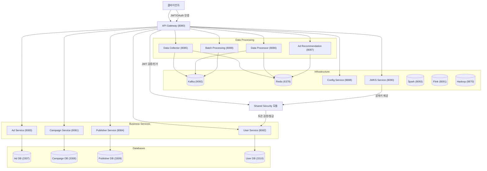

# 광고 도메인 MSA 아키텍처

Spring Boot 3와 DDD(Domain-Driven Design) 패턴을 기반으로 한 마이크로서비스 아키텍처입니다.

# 서비스별 실제 파일 트리 구조

### Ad Service (포트: 8083)
```
ad-service/
└── src/main/java/com/example/ad/
    ├── AdServiceApplication.java
    ├── config/
    ├── presentation/
    │   └── AdController.java
    ├── common/
    │   ├── config/
    │   │   └── OpenApiConfig.java
    │   ├── exception/
    │   │   ├── GlobalExceptionHandler.java
    │   │   ├── AdvertisementValidationException.java
    │   │   └── AdvertisementNotFoundException.java
    │   └── util/
    ├── domain/
    │   ├── Advertisement.java
    │   ├── event/
    │   │   ├── AdvertisementCreatedEvent.java
    │   │   └── AdvertisementStatusChangedEvent.java
    │   └── service/
    │       └── AdvertisementDomainService.java
    ├── infrastructure/
    │   └── repository/
    │       └── AdvertisementRepository.java
    ├── application/
    │   ├── dto/
    │   │   ├── AdvertisementRequest.java
    │   │   └── AdvertisementResponse.java
    │   └── service/
    │       └── AdvertisementService.java
```
- **역할:** 광고(Ad) 생성, 조회, 상태 변경 등 광고 도메인 비즈니스 로직 제공

### Campaign Service (포트: 8081)
```
campaign-service/
└── src/main/java/com/example/campaign/
    ├── CampaignServiceApplication.java
    ├── config/
    │   └── SecurityConfig.java
    ├── presentation/
    │   ├── CampaignController.java
    │   └── CampaignManagerController.java
    ├── common/
    │   ├── config/
    │   │   └── OpenApiConfig.java
    │   ├── exception/
    │   │   ├── GlobalExceptionHandler.java
    │   │   ├── CampaignValidationException.java
    │   │   └── CampaignNotFoundException.java
    │   └── util/
    │       └── CampaignValidator.java
    ├── domain/
    │   ├── Campaign.java
    │   ├── event/
    │   │   ├── CampaignCreatedEvent.java
    │   │   └── CampaignStatusChangedEvent.java
    │   └── service/
    │       └── CampaignDomainService.java
    ├── infrastructure/
    │   └── repository/
    │       └── CampaignRepository.java
    ├── application/
    │   ├── dto/
    │   │   ├── CreateCampaignRequest.java
    │   │   ├── UpdateCampaignRequest.java
    │   │   ├── CampaignResponse.java
    │   │   ├── CampaignSearchRequest.java
    │   │   ├── CampaignPerformanceRequest.java
    │   │   ├── CampaignPerformanceResponse.java
    │   │   ├── CampaignAnalyticsResponse.java
    │   │   ├── CampaignReportRequest.java
    │   │   ├── CampaignReportResponse.java
    │   │   ├── BudgetRequest.java
    │   │   ├── BulkUpdateRequest.java
    │   │   ├── BulkOperationResponse.java
    │   │   ├── ExportRequest.java
    │   │   ├── ExportResponse.java
    │   │   ├── RealtimeMonitoringResponse.java
    │   │   ├── DashboardRequest.java
    │   │   ├── DashboardResponse.java
    │   │   ├── WebhookRequest.java
    │   │   ├── WebhookResponse.java
    │   │   ├── AlertRequest.java
    │   │   ├── AlertResponse.java
    │   │   ├── ABTestRequest.java
    │   │   ├── ABTestResponse.java
    │   │   ├── ABTestResultResponse.java
    │   │   └── TargetingRequest.java
    │   └── service/
    │       └── CampaignService.java
```
- **역할:** 광고 캠페인 생성, 관리, 상태 변경 등 캠페인 도메인 비즈니스 로직 제공

### User Service (포트: 8082)
```
user-service/
└── src/main/java/com/example/user/
    ├── UserServiceApplication.java
    ├── config/
    │   └── SecurityConfig.java
    ├── presentation/
    │   ├── UserController.java
    │   ├── AuthController.java
    │   ├── SocialUserController.java
    │   └── JwkSetController.java
    ├── common/
    │   ├── config/
    │   │   └── OpenApiConfig.java
    │   ├── exception/
    │   │   └── GlobalExceptionHandler.java
    │   └── util/
    ├── domain/
    │   ├── User.java
    │   ├── SocialUser.java
    │   ├── UserBase.java
    │   ├── event/
    │   └── service/
    ├── infrastructure/
    │   └── repository/
    │       ├── UserRepository.java
    │       └── SocialUserRepository.java
    ├── application/
    │   ├── dto/
    │   │   ├── CreateUserRequest.java
    │   │   └── UserResponse.java
    │   └── service/
    │       ├── UserService.java
    │       ├── SocialUserService.java
    │       └── CommonUserService.java
```
- **역할:** 사용자 회원가입, 인증, 권한 관리 등 사용자 도메인 비즈니스 로직 제공

### Publisher Service (포트: 8084)
```
publisher-service/
└── src/main/java/com/example/publisher/
    ├── PublisherServiceApplication.java
    ├── config/
    ├── presentation/
    │   └── PublisherController.java
    ├── common/
    │   ├── config/
    │   │   └── OpenApiConfig.java
    │   ├── exception/
    │   └── util/
    ├── domain/
    │   ├── Publisher.java
    │   ├── event/
    │   └── service/
    ├── infrastructure/
    │   └── repository/
    │       └── PublisherRepository.java
```
- **역할:** 퍼블리셔(광고 매체) 등록, 관리, 상태 변경 등 퍼블리셔 도메인 비즈니스 로직 제공

### Data Collector Service (포트: 8085)
```
data-collector-service/
└── src/main/java/com/example/datacollector/
    ├── DataCollectorApplication.java
    ├── config/
    │   ├── KafkaConfig.java
    │   └── RedisConfig.java
    ├── presentation/
    │   └── DataCollectorController.java
    ├── domain/
    │   └── AdEvent.java
    ├── application/
    │   ├── dto/
    │   │   └── AdEventRequest.java
    │   └── service/
    │       └── DataCollectorService.java
```
- **역할:** 광고 이벤트 수집, Kafka 발행, Redis 메트릭 업데이트

### Data Processor Service (포트: 8086)
```
data-processor-service/
└── src/main/java/com/example/dataprocessor/
    ├── DataProcessorApplication.java
    ├── config/
    │   ├── KafkaConfig.java
    │   └── RedisConfig.java
    ├── domain/
    │   └── AdMetrics.java
    └── service/
        └── AdEventProcessor.java
```
- **역할:** Kafka 소비, 실시간/집계 메트릭 계산, 이상탐지

### Batch Processing Service (포트: 8088)
```
batch-processing-service/
└── src/main/java/com/example/batchprocessing/
    ├── BatchProcessingApplication.java
    ├── controller/
    │   └── BatchProcessingController.java
    ├── domain/
    │   └── BatchJobResult.java
    └── service/
        └── BatchProcessingService.java
```
- **역할:** 스케줄링, 배치 집계, 데이터 정리, 결과 발행

### Ad Recommendation Service (포트: 8087)
```
ad-recommendation-service/
└── src/main/java/com/example/adrecommendation/
    ├── AdRecommendationApplication.java
    ├── controller/
    │   └── AdRecommendationController.java
    ├── domain/
    │   ├── AdRecommendation.java
    │   ├── AdInventory.java
    │   └── UserProfile.java
    ├── dto/
    │   └── AdRecommendationRequest.java
    └── service/
        └── AdRecommendationService.java
```
- **역할:** 광고 추천 알고리즘, 실시간 추천 제공

### JWKS Service (포트: 8090)
```
jwks-service/
└── src/main/java/com/example/jwks/
    ├── JwksServiceApplication.java
    └── JwkSetController.java
```
- **역할:** JWT 공개키 제공, OAuth2 인증 지원

### API Gateway (포트: 8080)
```
api-gateway/
└── src/main/java/com/example/gateway/
    ├── ApiGatewayApplication.java
    ├── filter/
    │   └── JwtAuthenticationFilter.java
    └── config/
        └── GatewaySecurityConfig.java
```
- **역할:** 모든 외부 요청의 진입점, 인증/인가, 라우팅, 보안, 로깅, 모니터링

### Config Service (포트: 8888)
```
config-service/
└── src/main/java/com/example/config/
    └── ConfigServiceApplication.java
```
- **역할:** 모든 마이크로서비스의 설정 중앙화 및 동적 업데이트 지원

### Shared (인증/인가 포함)
```
shared/
└── src/main/java/com/example/shared/
    ├── domain/
    │   └── Campaign.java
    └── security/
        ├── JwtAuthenticationFilter.java
        ├── JwtTokenProvider.java
        ├── SecurityConstants.java
        ├── dto/
        │   ├── AuthRequest.java
        │   ├── AuthResponse.java
        │   ├── RefreshTokenRequest.java
        │   └── SocialLoginRequest.java
        └── provider/
            └── GoogleTokenVerifier.java
```
- **역할:** 인증/인가(JWT, OAuth 등) 및 보안 관련 공통 컴포넌트 제공

### Flink Apps
```
flink-apps/
└── src/main/java/com/example/advertising/
    ├── AdClickStreamProcessor.java
    ├── AdImpressionStreamProcessor.java
    └── config/
```
- **역할:** 실시간 스트림 처리, 광고 클릭/노출 이벤트 처리

### Spark Apps
```
spark-apps/
└── src/main/java/com/example/advertising/
    └── SparkDataProcessor.java
```
- **역할:** 대용량 데이터 배치 처리, 광고 메트릭 집계

---

## 핵심 기술스택
- **Backend**: Java 17, Spring Boot 3, Spring Cloud, Spring Security, Spring Data JPA
- **Database**: MySQL, Redis
- **Message Queue**: Apache Kafka
- **Infrastructure**: Docker, Consul, Apache Spark, Apache Flink, Hadoop
- **Documentation**: OpenAPI(Swagger)

---

## 전체 MSA 아키텍처 및 인증/인가 흐름 다이어그램



---

## 빌드 및 테스트

### 1. 전체 서비스 빌드
```bash
./build.sh
```

### 2. 테스트 실행 시 test 프로필 명시적으로 활성화
테스트 환경 설정(`application-test.yml`, test profile)이 적용되어 config-service를 사용하지 않고 테스트가 실행됩니다.

```bash
./mvnw clean package -Dspring.profiles.active=test
```

### 3. 모든 테스트를 건너뛰고 빌드만 할 경우
테스트를 실행하지 않고 빌드만 진행합니다.

```bash
./mvnw clean package -DskipTests
```

### 4. Docker Compose로 전체 시스템 실행
```bash
docker-compose up -d
```

---

## 추가 리소스

### Postman Collection
- **API Collection**: `postman/Advertising_MSA_API.postman_collection.json`
- **Environment**: `postman/Advertising_MSA_Environment.postman_environment.json`

### Documentation
- **SQL Scripts**: `docs/sql/` - 데이터베이스 스키마 및 초기화 스크립트
- **Swagger Guide**: `docs/swagger-ui-guide.md` - API 문서 사용 가이드
- **Data Pipeline**: `docs/data-pipeline-architecture.md` - 데이터 파이프라인 아키텍처

---
