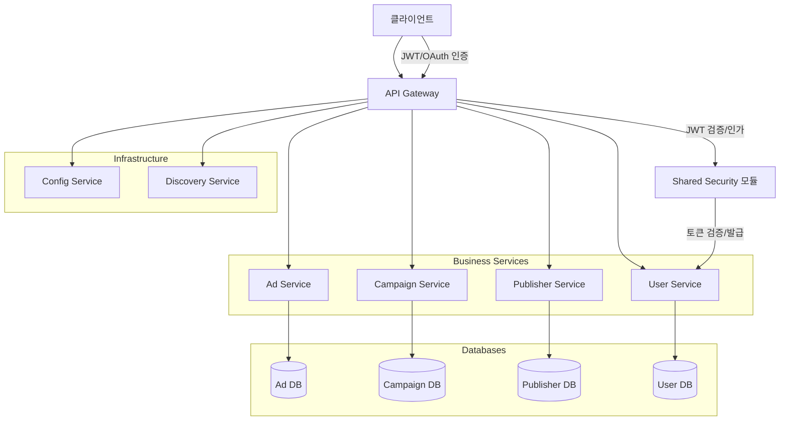

# 광고 도메인 MSA 아키텍처

Spring Boot 3와 DDD(Domain-Driven Design) 패턴을 기반으로 한 마이크로서비스 아키텍처입니다.

# 서비스별 실제 파일 트리 구조

### Ad Service
```
ad-service/
└── src/main/java/com/example/ad/
    ├── AdServiceApplication.java
    ├── config/
    ├── presentation/
    │   └── AdController.java
    ├── common/
    │   ├── config/
    │   │   └── OpenApiConfig.java
    │   ├── exception/
    │   │   ├── GlobalExceptionHandler.java
    │   │   ├── AdvertisementValidationException.java
    │   │   └── AdvertisementNotFoundException.java
    │   └── util/
    ├── domain/
    │   ├── Advertisement.java
    │   ├── event/
    │   │   ├── AdvertisementCreatedEvent.java
    │   │   └── AdvertisementStatusChangedEvent.java
    │   └── service/
    │       └── AdvertisementDomainService.java
    ├── infrastructure/
    │   └── repository/
    │       └── AdvertisementRepository.java
    ├── application/
    │   ├── dto/
    │   │   ├── AdvertisementRequest.java
    │   │   └── AdvertisementResponse.java
    │   └── service/
    │       └── AdvertisementService.java
```
- **역할:** 광고(Ad) 생성, 조회, 상태 변경 등 광고 도메인 비즈니스 로직 제공

### Campaign Service
```
campaign-service/
└── src/main/java/com/example/campaign/
    ├── CampaignServiceApplication.java
    ├── config/
    │   └── SecurityConfig.java
    ├── presentation/
    │   └── CampaignController.java
    ├── common/
    │   ├── config/
    │   │   └── OpenApiConfig.java
    │   ├── exception/
    │   │   ├── GlobalExceptionHandler.java
    │   │   ├── CampaignValidationException.java
    │   │   └── CampaignNotFoundException.java
    │   └── util/
    │       └── CampaignValidator.java
    ├── domain/
    │   ├── Campaign.java
    │   ├── event/
    │   │   ├── CampaignCreatedEvent.java
    │   │   └── CampaignStatusChangedEvent.java
    │   └── service/
    │       └── CampaignDomainService.java
    ├── infrastructure/
    │   └── repository/
    │       └── CampaignRepository.java
    ├── application/
    │   ├── dto/
    │   │   ├── CreateCampaignRequest.java
    │   │   └── CampaignResponse.java
    │   └── service/
    │       └── CampaignService.java
```
- **역할:** 광고 캠페인 생성, 관리, 상태 변경 등 캠페인 도메인 비즈니스 로직 제공

### User Service
```
user-service/
└── src/main/java/com/example/user/
    ├── UserServiceApplication.java
    ├── config/
    │   └── SecurityConfig.java
    ├── presentation/
    │   └── UserController.java
    ├── common/
    │   ├── config/
    │   │   └── OpenApiConfig.java
    │   ├── exception/
    │   │   └── GlobalExceptionHandler.java
    │   └── util/
    ├── domain/
    │   ├── User.java
    │   ├── event/
    │   └── service/
    ├── infrastructure/
    │   └── repository/
    │       └── UserRepository.java
    ├── application/
    │   ├── dto/
    │   │   ├── CreateUserRequest.java
    │   │   └── UserResponse.java
    │   └── service/
    │       └── UserService.java
```
- **역할:** 사용자 회원가입, 인증, 권한 관리 등 사용자 도메인 비즈니스 로직 제공

### Publisher Service
```
publisher-service/
└── src/main/java/com/example/publisher/
    ├── PublisherServiceApplication.java
    ├── config/
    ├── presentation/
    │   └── PublisherController.java
    ├── common/
    │   ├── config/
    │   │   └── OpenApiConfig.java
    │   ├── exception/
    │   └── util/
    ├── domain/
    │   ├── Publisher.java
    │   ├── event/
    │   └── service/
    ├── infrastructure/
    │   └── repository/
    │       └── PublisherRepository.java
```
- **역할:** 퍼블리셔(광고 매체) 등록, 관리, 상태 변경 등 퍼블리셔 도메인 비즈니스 로직 제공

### api-gateway
```
api-gateway/
└── src/main/java/com/example/gateway/
    ├── ApiGatewayApplication.java
    ├── filter/
    │   └── JwtAuthenticationFilter.java
    ├── config/
    │   └── GatewaySecurityConfig.java
```
- **역할:** 모든 외부 요청의 진입점, 인증/인가, 라우팅, 보안, 로깅, 모니터링

### config-service
```
config-service/
└── src/main/java/com/example/config/
    └── ConfigServiceApplication.java
```
- **역할:** 모든 마이크로서비스의 설정 중앙화 및 동적 업데이트 지원

### shared (인증/인가 포함)
```
shared/
└── src/main/java/com/example/shared/
    ├── domain/
    │   └── Campaign.java
    └── security/
        ├── JwtAuthenticationFilter.java
        ├── JwtTokenProvider.java
        ├── SecurityConstants.java
        ├── dto/
        │   ├── AuthRequest.java
        │   ├── AuthResponse.java
        │   ├── RefreshTokenRequest.java
        │   └── SocialLoginRequest.java
        ├── provider/
        │   └── GoogleTokenVerifier.java
```
- **역할:** 인증/인가(JWT, OAuth 등) 및 보안 관련 공통 컴포넌트 제공

---

## 핵심 기술스택
- Java 17, Spring Boot 3, Spring Cloud, Spring Security, Spring Data JPA
- MySQL, Redis, Docker, Consul, OpenAPI(Swagger)

---

## 전체 MSA 아키텍처 및 인증/인가 흐름 다이어그램



---

## 빌드 및 테스트

### 1. 테스트 실행 시 test 프로필 명시적으로 활성화
테스트 환경 설정(`application-test.yml`, test profile)이 적용되어 config-service를 사용하지 않고 테스트가 실행됩니다.

```bash
./mvnw clean package -Dspring.profiles.active=test
```

### 2. 모든 테스트를 건너뛰고 빌드만 할 경우
테스트를 실행하지 않고 빌드만 진행합니다.

```bash
./mvnw clean package -DskipTests
```
