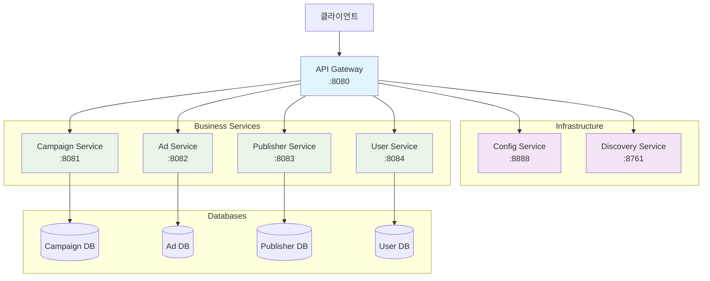
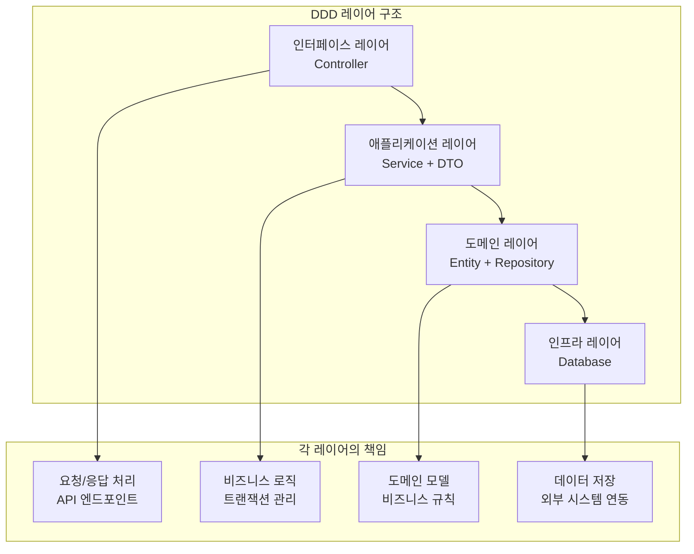
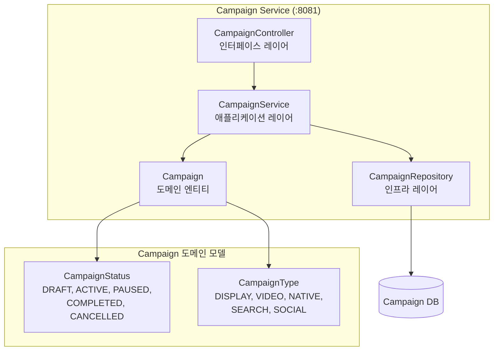
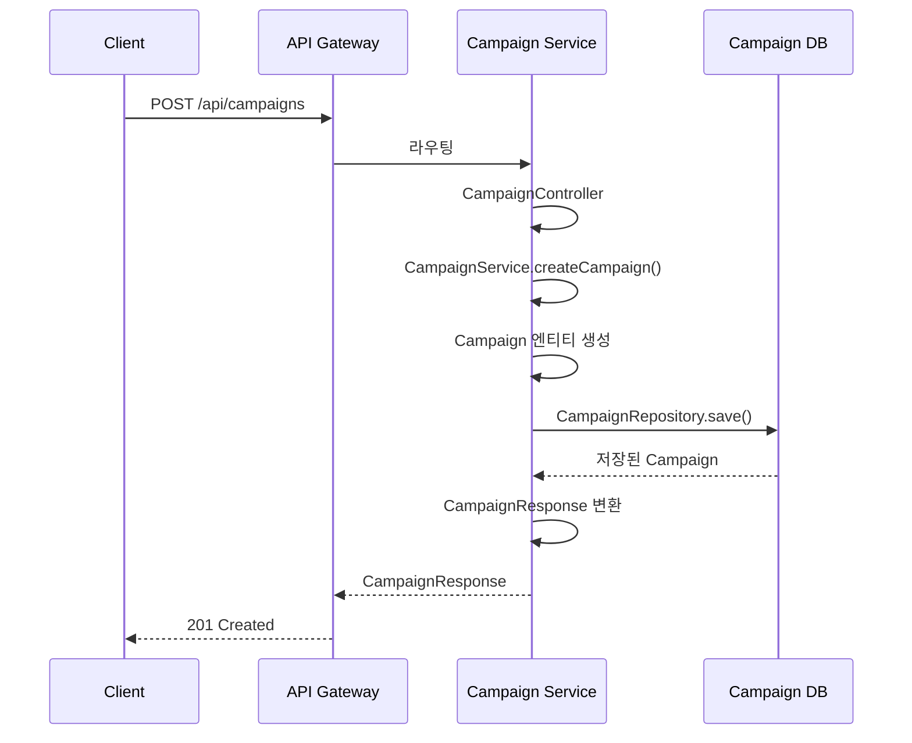
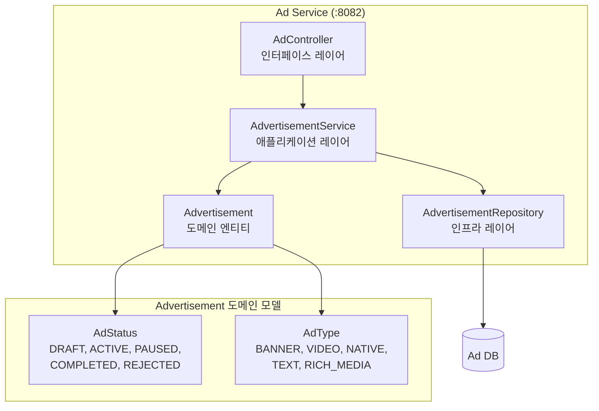
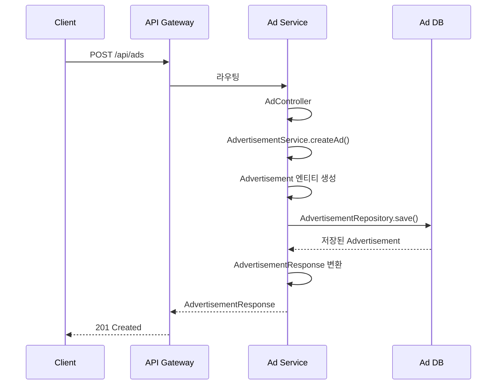
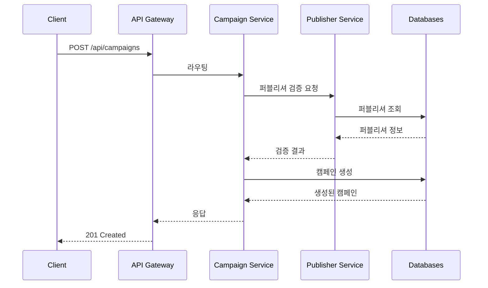
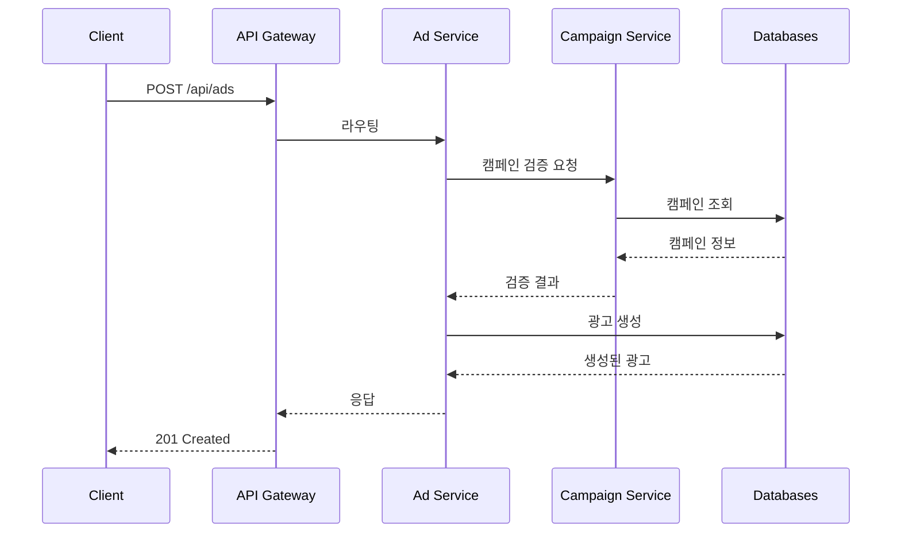
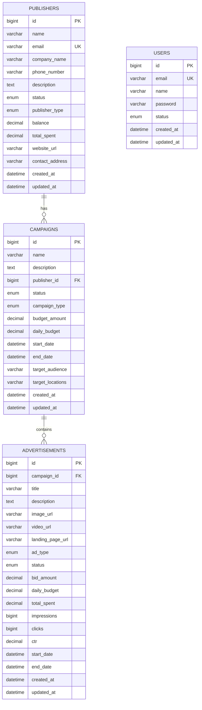
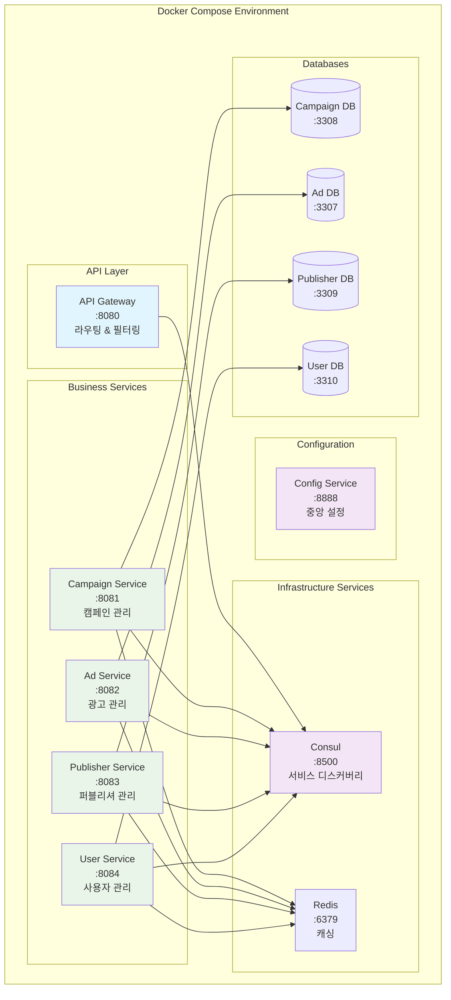

# 광고 도메인 MSA 아키텍처

Spring Boot 3와 DDD(Domain-Driven Design) 패턴을 기반으로 한 마이크로서비스 아키텍처입니다.

## 🏗️ 전체 MSA 아키텍처



## 📁 프로젝트 구조

```
demo/
├── README.md                    # 이 파일 (프로젝트 개요)
├── docs/                        # 📚 문서 디렉토리
│   ├── README.md               # 📖 상세 기술 문서
│   ├── images/                 # 🖼️ 다이어그램 및 이미지
│   │   ├── msa-architecture-diagram.md
│   │   ├── campaign-service-structure.md
│   │   ├── ad-service-structure.md
│   │   ├── service-communication-flow.md
│   │   ├── ddd-architecture-pattern.md
│   │   ├── database-schema-relationship.md
│   │   ├── kubernetes-deployment-scaling.md
│   │   ├── database-connection-info.md
│   │   └── cursor-db-gui-guide.md
│   └── sql/                    # 🗄️ 데이터베이스 스키마
│       ├── init.sql
│       ├── init-campaign-db.sql
│       ├── init-ad-db.sql
│       ├── init-publisher-db.sql
│       ├── init-user-db.sql
│       ├── campaign-service-schema.sql
│       ├── ad-service-schema.sql
│       ├── publisher-service-schema.sql
│       └── user-service-schema.sql
├── config-service/              # ⚙️ 설정 관리 서비스
├── discovery-service/           # 🔍 서비스 디스커버리
├── api-gateway/                 # 🚪 API 게이트웨이
├── campaign-service/            # 📢 캠페인 관리 서비스
├── ad-service/                  # 📺 광고 관리 서비스
├── publisher-service/           # 👥 퍼블리셔 관리 서비스
├── user-service/                # 👤 사용자 관리 서비스
├── shared/                      # 🔗 공유 모듈
├── k8s/                         # ☸️ Kubernetes 매니페스트
├── postman/                     # 📮 API 테스트 환경
├── docker-compose.yml           # 🐳 Docker Compose 설정
├── build.sh                     # 🔨 빌드 스크립트
└── run-all-tests.sh             # 🧪 테스트 실행 스크립트
```

## 🛠️ 기술 스택

### Backend
- **Java 17**
- **Spring Boot 3.2.6**
- **Spring Cloud 2023.0.4**
- **Spring Cloud Consul Discovery**
- **Spring Data JPA**
- **Spring Boot Actuator**

### API Documentation
- **SpringDoc OpenAPI 2.3.0** (Swagger UI)
- **OpenAPI 3.0** 명세

### Database & Cache
- **MySQL 8.0**
- **Redis 7-alpine**
- **H2 Database** (테스트용)

### Infrastructure
- **Docker & Docker Compose 3.8**
- **Consul 1.15** (서비스 디스커버리)

### Development Tools
- **Maven**
- **Lombok**
- **Postman** (API 테스트)

## 🏛️ DDD 아키텍처 패턴

각 서비스는 Domain-Driven Design 패턴을 따릅니다:



---

## 🚪 1. API Gateway Service

### API Gateway 구조
```
api-gateway/
├── src/main/java/com/example/gateway/
│   └── ApiGatewayApplication.java           # 게이트웨이 애플리케이션
├── src/main/resources/
│   └── application.yml                      # 라우팅 설정
└── pom.xml                                  # Maven 의존성
```

**역할**: 모든 외부 요청의 진입점으로, 요청을 적절한 서비스로 라우팅하고 인증, 로깅, 모니터링을 담당합니다.

---

## ⚙️ 2. Config Service

### Config Service 구조
```
config-service/
├── src/main/java/com/example/config/
│   └── ConfigServiceApplication.java        # 설정 서비스 애플리케이션
├── src/main/resources/
│   ├── application.yml                      # 기본 설정
│   ├── bootstrap.yml                        # 부트스트랩 설정
│   └── config/                              # 중앙화된 설정 파일들
│       ├── ad-service.yml
│       ├── api-gateway.yml
│       ├── campaign-service.yml
│       ├── publisher-service.yml
│       └── user-service.yml
└── pom.xml                                  # Maven 의존성
```

**역할**: 모든 마이크로서비스의 설정을 중앙화하여 관리하며, 설정 변경 시 서비스 재시작 없이 동적 업데이트를 지원합니다.

---

## 🔍 3. Discovery Service

### Discovery Service 구조
```
discovery-service/
├── src/main/java/com/example/discovery/
│   └── DiscoveryServiceApplication.java     # 디스커버리 애플리케이션
├── src/main/resources/
│   └── application.yml                      # 디스커버리 설정
└── pom.xml                                  # Maven 의존성
```

**역할**: Consul을 사용하여 서비스 디스커버리를 제공하며, 서비스 간 동적 연결과 로드 밸런싱을 지원합니다.

---

## 📢 4. Campaign Service

### Campaign Service 구조 다이어그램



### Campaign Service 실행 흐름



### Campaign Service 구조
```
campaign-service/
├── src/main/java/com/example/campaign/
│   ├── CampaignServiceApplication.java
│   ├── domain/
│   │   ├── Campaign.java                    # 도메인 엔티티
│   │   └── repository/
│   │       └── CampaignRepository.java      # 리포지토리 인터페이스
│   ├── application/
│   │   ├── dto/
│   │   │   ├── CreateCampaignRequest.java   # 요청 DTO
│   │   │   └── CampaignResponse.java        # 응답 DTO
│   │   └── service/
│   │       └── CampaignService.java         # 애플리케이션 서비스
│   └── interfaces/
│       └── CampaignController.java          # REST 컨트롤러
├── src/main/resources/
│   └── application.yml                      # 설정 파일
└── pom.xml                                  # Maven 의존성
```

**역할**: 광고 캠페인을 관리하며, 캠페인 생성, 조회, 상태 변경, 예산 관리 등의 기능을 제공합니다.

---

## 📺 5. Ad Service

### Ad Service 구조 다이어그램



### Ad Service 실행 흐름



### Ad Service 구조
```
ad-service/
├── src/main/java/com/example/ad/
│   ├── AdServiceApplication.java
│   ├── domain/
│   │   ├── Advertisement.java               # 도메인 엔티티
│   │   └── repository/
│   │       └── AdvertisementRepository.java # 리포지토리 인터페이스
│   ├── application/
│   │   ├── dto/
│   │   │   ├── AdvertisementRequest.java    # 요청 DTO
│   │   │   └── AdvertisementResponse.java   # 응답 DTO
│   │   └── service/
│   │       └── AdvertisementService.java    # 애플리케이션 서비스
│   └── interfaces/
│       └── AdController.java                # REST 컨트롤러
├── src/main/resources/
│   └── application.yml                      # 설정 파일
└── pom.xml                                  # Maven 의존성
```

**역할**: 광고 콘텐츠를 관리하며, 광고 생성, 조회, 상태 변경, 메트릭 업데이트 등의 기능을 제공합니다.

---

## 👥 6. Publisher Service

### Publisher Service 구조
```
publisher-service/
├── src/main/java/com/example/publisher/
│   ├── PublisherServiceApplication.java
│   ├── domain/
│   │   ├── Publisher.java                   # 도메인 엔티티
│   │   └── repository/
│   │       └── PublisherRepository.java     # 리포지토리 인터페이스
│   ├── application/
│   │   ├── dto/
│   │   │   ├── PublisherRequest.java        # 요청 DTO
│   │   │   └── PublisherResponse.java       # 응답 DTO
│   │   └── service/
│   │       └── PublisherService.java        # 애플리케이션 서비스
│   └── interfaces/
│       └── PublisherController.java         # REST 컨트롤러
├── src/main/resources/
│   └── application.yml                      # 설정 파일
└── pom.xml                                  # Maven 의존성
```

**역할**: 광고주와 퍼블리셔를 관리하며, 계정 생성, 조회, 상태 변경, 잔액 관리 등의 기능을 제공합니다.

---

## 👤 7. User Service

### User Service 구조
```
user-service/
├── src/main/java/com/example/user/
│   ├── UserServiceApplication.java
│   ├── domain/
│   │   ├── User.java                        # 도메인 엔티티
│   │   └── repository/
│   │       └── UserRepository.java          # 리포지토리 인터페이스
│   ├── application/
│   │   ├── dto/
│   │   │   ├── CreateUserRequest.java       # 요청 DTO
│   │   │   └── UserResponse.java            # 응답 DTO
│   │   └── service/
│   │       └── UserService.java             # 애플리케이션 서비스
│   └── interfaces/
│       └── UserController.java              # REST 컨트롤러
├── src/main/resources/
│   └── application.yml                      # 설정 파일
└── pom.xml                                  # Maven 의존성
```

**역할**: 사용자 계정을 관리하며, 사용자 등록, 조회, 인증, 권한 관리 등의 기능을 제공합니다.

---

## 🔄 서비스 간 통신 흐름

### 캠페인 생성 시 서비스 간 통신



### 광고 생성 시 서비스 간 통신



## 🗄️ 데이터베이스 스키마 관계



## 🐳 Docker Compose 배포 구조



## 🚀 빠른 시작

### 1. 프로젝트 클론
```bash
git clone <repository-url>
cd demo
```

### 2. Docker Compose로 실행 (로컬 개발)
```bash
# 프로젝트 빌드
./build.sh

# 서비스 실행
docker-compose up -d
```

### 3. 서비스 확인
- **API Gateway**: http://localhost:8080
- **Campaign Service**: http://localhost:8081
- **Ad Service**: http://localhost:8082
- **Publisher Service**: http://localhost:8083
- **User Service**: http://localhost:8084

## 📚 문서

### 📖 Swagger 기술 문서
- [📖 Swagger UI 가이드](docs/swagger-ui-guide.md) - Swagger UI 사용법 및 API 테스트 가이드

### 🖼️ 아키텍처 다이어그램
- [🏗️ 전체 MSA 아키텍처](docs/images/msa-architecture-diagram.md)
- [📢 Campaign Service 구조](docs/images/campaign-service-structure.md)
- [📺 Ad Service 구조](docs/images/ad-service-structure.md)
- [🔄 서비스 간 통신 흐름](docs/images/service-communication-flow.md)
- [🏛️ DDD 아키텍처 패턴](docs/images/ddd-architecture-pattern.md)
- [🗄️ 데이터베이스 스키마 관계](docs/images/database-schema-relationship.md)
- [☸️ Kubernetes 배포 및 스케일링](docs/images/kubernetes-deployment-scaling.md)

### 🗄️ 데이터베이스
- [🔗 데이터베이스 연결 정보](docs/images/database-connection-info.md)
- [🖥️ Cursor DB GUI 가이드](docs/images/cursor-db-gui-guide.md)
- [📁 SQL 스키마 파일들](docs/sql/)

## 🧪 테스트

```bash
# 모든 테스트 실행
./run-all-tests.sh

# 개별 서비스 테스트
cd campaign-service && mvn test
cd ad-service && mvn test
cd publisher-service && mvn test
cd user-service && mvn test
```

## 📮 API 테스트

Postman 컬렉션과 환경 설정이 포함되어 있습니다:
- [📮 Postman 컬렉션](postman/Advertising_MSA_API.postman_collection.json)
- [🌍 Postman 환경](postman/Advertising_MSA_Environment.postman_environment.json)
- [📖 API 테스트 가이드](postman/API_Test_Guide.md)

## 📖 Swagger UI (OpenAPI 문서)

각 서비스는 Swagger UI를 통해 API 문서를 제공합니다. 서비스 실행 후 다음 URL에서 API 문서를 확인할 수 있습니다:

### 🔗 Swagger UI 접속 URL
- **Campaign Service**: http://localhost:8081/swagger-ui.html
- **User Service**: http://localhost:8082/swagger-ui.html
- **Ad Service**: http://localhost:8083/swagger-ui.html  
- **Publisher Service**: http://localhost:8084/swagger-ui.html

### 📋 OpenAPI JSON 문서
- **Campaign Service**: http://localhost:8081/api-docs
- **User Service**: http://localhost:8082/api-docs
- **Ad Service**: http://localhost:8083/api-docs
- **Publisher Service**: http://localhost:8084/api-docs

### 🛠️ Swagger UI 기능
- **API 엔드포인트 탐색**: 모든 REST API 엔드포인트를 카테고리별로 확인
- **실시간 API 테스트**: 브라우저에서 직접 API 호출 및 응답 확인
- **요청/응답 스키마**: JSON 스키마를 통한 데이터 구조 이해
- **상태 코드**: 각 엔드포인트별 HTTP 상태 코드 및 에러 응답 확인
- **인증 정보**: API 인증 방식 및 헤더 정보 제공

### 📝 사용 예시
1. 브라우저에서 `http://localhost:8081/swagger-ui.html` 접속
2. Campaign Service의 API 목록 확인
3. "POST /campaigns" 엔드포인트 클릭
4. "Try it out" 버튼 클릭
5. 요청 데이터 입력 후 "Execute" 버튼으로 API 테스트
6. 응답 결과 및 상태 코드 확인

## 🤝 기여하기

1. Fork the Project
2. Create your Feature Branch (`git checkout -b feature/AmazingFeature`)
3. Commit your Changes (`git commit -m 'Add some AmazingFeature'`)
4. Push to the Branch (`git push origin feature/AmazingFeature`)
5. Open a Pull Request

## 📄 라이선스

이 프로젝트는 MIT 라이선스 하에 배포됩니다.

## 📞 문의

프로젝트에 대한 질문이나 제안사항이 있으시면 이슈를 생성해 주세요. 