# 광고 도메인 MSA 아키텍처

Spring Boot 3와 DDD(Domain-Driven Design) 패턴을 기반으로 한 마이크로서비스 아키텍처입니다.

## 🏗️ 전체 MSA 아키텍처


## 📁 프로젝트 구조 (개선된 DDD 패턴)

```
demo/
├── README.md                    # 이 파일 (프로젝트 개요)
├── docs/                        # 📚 문서 디렉토리
│   ├── README.md               # 📖 상세 기술 문서
│   ├── images/                 # 🖼️ 다이어그램 및 이미지
│   │   ├── msa-architecture-diagram.md
│   │   ├── campaign-service-structure.md
│   │   ├── ad-service-structure.md
│   │   ├── service-communication-flow.md
│   │   ├── ddd-architecture-pattern.md
│   │   ├── database-schema-relationship.md
│   │   ├── kubernetes-deployment-scaling.md
│   │   ├── database-connection-info.md
│   │   └── cursor-db-gui-guide.md
│   └── sql/                    # 🗄️ 데이터베이스 스키마
│       ├── init.sql
│       ├── init-campaign-db.sql
│       ├── init-ad-db.sql
│       ├── init-publisher-db.sql
│       ├── init-user-db.sql
│       ├── campaign-service-schema.sql
│       ├── ad-service-schema.sql
│       ├── publisher-service-schema.sql
│       └── user-service-schema.sql
├── config-service/              # ⚙️ 설정 관리 서비스
├── discovery-service/           # 🔍 서비스 디스커버리
├── api-gateway/                 # 🚪 API 게이트웨이
├── campaign-service/            # 📢 캠페인 관리 서비스 (개선된 DDD)
│   ├── presentation/           # 🎯 REST API 컨트롤러
│   ├── application/            # 📋 애플리케이션 서비스 + DTO
│   ├── domain/                 # 🏛️ 도메인 엔티티 + 서비스 + 이벤트
│   ├── infrastructure/         # 🏗️ 데이터 접근 + 외부 연동
│   └── common/                 # 🔧 공통 기능 (예외, 설정, 유틸리티)
├── ad-service/                  # 📺 광고 관리 서비스 (개선된 DDD)
│   ├── presentation/           # 🎯 REST API 컨트롤러
│   ├── application/            # 📋 애플리케이션 서비스 + DTO
│   ├── domain/                 # 🏛️ 도메인 엔티티 + 서비스 + 이벤트
│   ├── infrastructure/         # 🏗️ 데이터 접근 + 외부 연동
│   └── common/                 # 🔧 공통 기능 (예외, 설정, 유틸리티)
├── publisher-service/           # 👥 퍼블리셔 관리 서비스 (개선된 DDD)
│   ├── presentation/           # 🎯 REST API 컨트롤러
│   ├── application/            # 📋 애플리케이션 서비스 + DTO
│   ├── domain/                 # 🏛️ 도메인 엔티티 + 서비스 + 이벤트
│   ├── infrastructure/         # 🏗️ 데이터 접근 + 외부 연동
│   └── common/                 # 🔧 공통 기능 (예외, 설정, 유틸리티)
├── user-service/                # 👤 사용자 관리 서비스 (개선된 DDD)
│   ├── presentation/           # 🎯 REST API 컨트롤러
│   ├── application/            # 📋 애플리케이션 서비스 + DTO
│   ├── domain/                 # 🏛️ 도메인 엔티티 + 서비스 + 이벤트
│   ├── infrastructure/         # 🏗️ 데이터 접근 + 외부 연동
│   └── common/                 # 🔧 공통 기능 (예외, 설정, 유틸리티)
├── shared/                      # 🔗 공유 모듈
├── k8s/                         # ☸️ Kubernetes 매니페스트
├── postman/                     # 📮 API 테스트 환경
├── docker-compose.yml           # 🐳 Docker Compose 설정
├── build.sh                     # 🔨 빌드 스크립트
└── run-all-tests.sh             # 🧪 테스트 실행 스크립트
```

## 🛠️ 기술 스택

### Backend
- **Java 17**
- **Spring Boot 3.2.6**
- **Spring Cloud 2023.0.4**
- **Spring Cloud Consul Discovery**
- **Spring Data JPA**
- **Spring Boot Actuator**

### API Documentation
- **SpringDoc OpenAPI 2.3.0** (Swagger UI)
- **OpenAPI 3.0** 명세

### Database & Cache
- **MySQL 8.0**
- **Redis 7-alpine**
- **H2 Database** (테스트용)

### Infrastructure
- **Docker & Docker Compose 3.8**
- **Consul 1.15** (서비스 디스커버리)

### Development Tools
- **Maven**
- **Lombok**
- **Postman** (API 테스트)

## 🏛️ DDD 아키텍처 패턴 (개선된 구조)

각 서비스는 개선된 Domain-Driven Design 패턴을 따릅니다:

```mermaid
graph TB
    subgraph "개선된 DDD 레이어 구조"
        Presentation[🎯 Presentation Layer<br/>Controller]
        Application[📋 Application Layer<br/>Service + DTO]
        Domain[🏛️ Domain Layer<br/>Entity + DomainService + Event]
        Infrastructure[🏗️ Infrastructure Layer<br/>Repository + External]
        Common[🔧 Common Layer<br/>Exception + Config + Util]
    end
    
    Presentation --> Application
    Application --> Domain
    Domain --> Infrastructure
    Application --> Common
    Domain --> Common
    
    subgraph "각 레이어의 책임"
        Presentation --> P_Resp[REST API 엔드포인트<br/>요청/응답 처리<br/>API 문서화]
        Application --> A_Resp[애플리케이션 로직<br/>트랜잭션 관리<br/>DTO 변환]
        Domain --> D_Resp[도메인 모델<br/>비즈니스 규칙<br/>도메인 이벤트]
        Infrastructure --> I_Resp[데이터 접근<br/>외부 시스템 연동<br/>메시징]
        Common --> C_Resp[공통 기능<br/>예외 처리<br/>설정 관리<br/>유틸리티]
    end
```



### 주요 개선사항

#### 1. **명확한 계층 분리**
- **Presentation Layer**: REST API 컨트롤러와 요청/응답 처리
- **Application Layer**: 애플리케이션 서비스와 트랜잭션 관리
- **Domain Layer**: 도메인 엔티티, 도메인 서비스, 도메인 이벤트
- **Infrastructure Layer**: 데이터 접근과 외부 시스템 연동
- **Common Layer**: 공통 기능, 예외 처리, 설정 관리

#### 2. **도메인 서비스 도입**
- 복잡한 비즈니스 로직을 도메인 서비스로 분리
- 도메인 규칙 검증과 이벤트 발행 담당
- 애플리케이션 서비스와 도메인 로직의 명확한 분리

#### 3. **도메인 이벤트 패턴**
- 도메인 상태 변경 시 이벤트 발행
- 느슨한 결합과 확장성 향상
- 이벤트 기반 아키텍처 지원

#### 4. **커스텀 예외 처리**
- 도메인별 커스텀 예외 클래스
- 전역 예외 처리기로 일관된 에러 응답
- 명확한 에러 메시지와 상태 코드

#### 5. **공통 컴포넌트 분리**
- 검증 로직, 설정, 유틸리티를 공통 패키지로 분리
- 재사용성과 유지보수성 향상
- 일관된 코드 스타일과 패턴

---

## 🚪 1. API Gateway Service

### API Gateway 구조
```
api-gateway/
├── src/main/java/com/example/gateway/
│   └── ApiGatewayApplication.java           # 게이트웨이 애플리케이션
├── src/main/resources/
│   └── application.yml                      # 라우팅 설정
└── pom.xml                                  # Maven 의존성
```

**역할**: 모든 외부 요청의 진입점으로, 요청을 적절한 서비스로 라우팅하고 인증, 로깅, 모니터링을 담당합니다.

---

## ⚙️ 2. Config Service

### Config Service 구조
```
config-service/
├── src/main/java/com/example/config/
│   └── ConfigServiceApplication.java        # 설정 서비스 애플리케이션
├── src/main/resources/
│   ├── application.yml                      # 기본 설정
│   ├── bootstrap.yml                        # 부트스트랩 설정
│   └── config/                              # 중앙화된 설정 파일들
│       ├── ad-service.yml
│       ├── api-gateway.yml
│       ├── campaign-service.yml
│       ├── publisher-service.yml
│       └── user-service.yml
└── pom.xml                                  # Maven 의존성
```

**역할**: 모든 마이크로서비스의 설정을 중앙화하여 관리하며, 설정 변경 시 서비스 재시작 없이 동적 업데이트를 지원합니다.

---

## 🔍 3. Discovery Service

### Discovery Service 구조
```
discovery-service/
├── src/main/java/com/example/discovery/
│   └── DiscoveryServiceApplication.java     # 디스커버리 애플리케이션
├── src/main/resources/
│   └── application.yml                      # 디스커버리 설정
└── pom.xml                                  # Maven 의존성
```

**역할**: Consul을 사용하여 서비스 디스커버리를 제공하며, 서비스 간 동적 연결과 로드 밸런싱을 지원합니다.

---

## 📢 4. Campaign Service

### Campaign Service 구조 다이어그램 (개선된 구조)

```mermaid
graph TB
    subgraph "Campaign Service (:8081) - 개선된 구조"
        C_Controller[CampaignController<br/>🎯 Presentation Layer]
        C_AppService[CampaignService<br/>📋 Application Layer]
        C_DomainService[CampaignDomainService<br/>🏛️ Domain Layer]
        C_Entity[Campaign<br/>🏛️ Domain Entity]
        C_Repo[CampaignRepository<br/>🏗️ Infrastructure Layer]
        C_Events[Domain Events<br/>🏛️ CampaignCreatedEvent<br/>CampaignStatusChangedEvent]
        C_Exceptions[Custom Exceptions<br/>🔧 CampaignNotFoundException<br/>CampaignValidationException]
    end
    
    C_Controller --> C_AppService
    C_AppService --> C_DomainService
    C_DomainService --> C_Entity
    C_DomainService --> C_Repo
    C_DomainService --> C_Events
    C_AppService --> C_Exceptions
    C_DomainService --> C_Exceptions
    C_Repo --> CampaignDB[(Campaign DB)]
    
    subgraph "Campaign 도메인 모델"
        C_Entity --> C_Status[CampaignStatus<br/>DRAFT, ACTIVE, PAUSED,<br/>COMPLETED, CANCELLED]
        C_Entity --> C_Type[CampaignType<br/>DISPLAY, VIDEO, NATIVE,<br/>SEARCH, SOCIAL]
    end
    
    subgraph "개선된 기능"
        C_Events --> Event_Resp[도메인 이벤트 발행<br/>느슨한 결합]
        C_Exceptions --> Exception_Resp[커스텀 예외 처리<br/>명확한 에러 메시지]
        C_DomainService --> Domain_Resp[도메인 로직 분리<br/>비즈니스 규칙 검증]
    end
```



### Campaign Service 실행 흐름 (개선된 구조)

```mermaid
sequenceDiagram
    participant Client
    participant Gateway as API Gateway
    participant Controller as CampaignController
    participant AppService as CampaignService
    participant DomainService as CampaignDomainService
    participant Repository as CampaignRepository
    participant DB as Campaign DB
    participant EventPublisher as EventPublisher
    
    Client->>Gateway: POST /api/campaigns
    Gateway->>Controller: 라우팅
    Controller->>AppService: createCampaign(request)
    AppService->>AppService: Campaign 엔티티 생성
    AppService->>DomainService: createCampaign(campaign)
    DomainService->>DomainService: 비즈니스 규칙 검증
    DomainService->>Repository: save(campaign)
    Repository->>DB: INSERT
    DB-->>Repository: 저장된 Campaign
    DomainService->>EventPublisher: publishEvent(CampaignCreatedEvent)
    DomainService-->>AppService: Campaign
    AppService->>AppService: CampaignResponse 변환
    AppService-->>Controller: CampaignResponse
    Controller-->>Gateway: 201 Created
    Gateway-->>Client: 201 Created
```



### 주요 개선사항

#### 1. **패키지 네이밍 개선**
- `interfaces` → `presentation`: 더 직관적인 네이밍
- `config` → `common/config`: 공통 설정 관리
- `domain/repository` → `infrastructure/repository`: 인프라 계층 분리

#### 2. **도메인 서비스 도입**
- 복잡한 비즈니스 로직을 `CampaignDomainService`로 분리
- 도메인 규칙 검증 및 이벤트 발행 담당

#### 3. **도메인 이벤트 패턴**
- `CampaignCreatedEvent`: 캠페인 생성 시 이벤트 발행
- `CampaignStatusChangedEvent`: 상태 변경 시 이벤트 발행
- 느슨한 결합과 확장성 향상

#### 4. **커스텀 예외 처리**
- `CampaignNotFoundException`: 리소스 없음 예외
- `CampaignValidationException`: 검증 실패 예외
- `GlobalExceptionHandler`: 전역 예외 처리

#### 5. **공통 유틸리티**
- `CampaignValidator`: 검증 로직 중앙화
- 재사용 가능한 검증 규칙 제공

### Campaign Service 구조 (개선된 DDD 패턴)

```
campaign-service/
├── src/main/java/com/example/campaign/
│   ├── CampaignServiceApplication.java      # 애플리케이션 진입점
│   ├── presentation/                        # 🎯 프레젠테이션 레이어
│   │   └── CampaignController.java          # REST API 컨트롤러
│   ├── application/                         # 📋 애플리케이션 레이어
│   │   ├── dto/
│   │   │   ├── CreateCampaignRequest.java   # 요청 DTO
│   │   │   └── CampaignResponse.java        # 응답 DTO
│   │   └── service/
│   │       └── CampaignService.java         # 애플리케이션 서비스
│   ├── domain/                              # 🏛️ 도메인 레이어
│   │   ├── Campaign.java                    # 도메인 엔티티
│   │   ├── service/
│   │   │   └── CampaignDomainService.java   # 도메인 서비스
│   │   └── event/                           # 도메인 이벤트
│   │       ├── CampaignCreatedEvent.java
│   │       └── CampaignStatusChangedEvent.java
│   ├── infrastructure/                      # 🏗️ 인프라스트럭처 레이어
│   │   └── repository/
│   │       └── CampaignRepository.java      # JPA 리포지토리
│   └── common/                              # 🔧 공통 컴포넌트
│       ├── config/
│       │   └── OpenApiConfig.java           # OpenAPI 설정
│       ├── exception/                       # 커스텀 예외
│       │   ├── CampaignNotFoundException.java
│       │   ├── CampaignValidationException.java
│       │   └── GlobalExceptionHandler.java  # 전역 예외 처리
│       └── util/
│           └── CampaignValidator.java       # 검증 유틸리티
├── src/main/resources/
│   └── application.yml                      # 설정 파일
└── pom.xml                                  # Maven 의존성
```

### 개선된 DDD 아키텍처 패턴

```mermaid
graph TB
    subgraph "Campaign Service - 개선된 DDD 구조"
        Presentation[🎯 Presentation Layer<br/>CampaignController]
        Application[📋 Application Layer<br/>CampaignService]
        Domain[🏛️ Domain Layer<br/>Campaign + DomainService]
        Infrastructure[🏗️ Infrastructure Layer<br/>CampaignRepository]
        Common[🔧 Common Layer<br/>Exception + Config + Util]
    end
    
    Presentation --> Application
    Application --> Domain
    Domain --> Infrastructure
    Application --> Common
    Domain --> Common
    
    subgraph "각 레이어의 책임"
        Presentation --> P_Resp[REST API 엔드포인트<br/>요청/응답 처리]
        Application --> A_Resp[애플리케이션 로직<br/>트랜잭션 관리]
        Domain --> D_Resp[도메인 모델<br/>비즈니스 규칙<br/>도메인 이벤트]
        Infrastructure --> I_Resp[데이터 접근<br/>외부 시스템 연동]
        Common --> C_Resp[공통 기능<br/>예외 처리<br/>설정 관리]
    end
```



**역할**: 광고 캠페인을 관리하며, 캠페인 생성, 조회, 상태 변경, 예산 관리 등의 기능을 제공합니다.

---

## 📺 5. Ad Service

### Ad Service 구조 다이어그램

```mermaid
graph TB
    subgraph "Ad Service (:8082)"
        A_Controller[AdController<br/>인터페이스 레이어]
        A_Service[AdvertisementService<br/>애플리케이션 레이어]
        A_Entity[Advertisement<br/>도메인 엔티티]
        A_Repo[AdvertisementRepository<br/>인프라 레이어]
    end
    
    A_Controller --> A_Service
    A_Service --> A_Entity
    A_Service --> A_Repo
    A_Repo --> AdDB[(Ad DB)]
    
    subgraph "Advertisement 도메인 모델"
        A_Entity --> A_Status[AdStatus<br/>DRAFT, ACTIVE, PAUSED,<br/>COMPLETED, REJECTED]
        A_Entity --> A_Type[AdType<br/>BANNER, VIDEO, NATIVE,<br/>TEXT, RICH_MEDIA]
    end
```



### Ad Service 실행 흐름 (개선된 구조)

```mermaid
sequenceDiagram
    participant Client
    participant Gateway as API Gateway
    participant Controller as AdController
    participant AppService as AdvertisementService
    participant DomainService as AdvertisementDomainService
    participant Repository as AdvertisementRepository
    participant DB as Ad DB
    participant EventPublisher as EventPublisher
    
    Client->>Gateway: POST /api/ads
    Gateway->>Controller: 라우팅
    Controller->>AppService: createAd(request)
    AppService->>AppService: Advertisement 엔티티 생성
    AppService->>DomainService: createAdvertisement(advertisement)
    DomainService->>DomainService: 비즈니스 규칙 검증
    DomainService->>Repository: save(advertisement)
    Repository->>DB: INSERT
    DB-->>Repository: 저장된 Advertisement
    DomainService->>EventPublisher: publishEvent(AdvertisementCreatedEvent)
    DomainService-->>AppService: Advertisement
    AppService->>AppService: AdvertisementResponse 변환
    AppService-->>Controller: AdvertisementResponse
    Controller-->>Gateway: 201 Created
    Gateway-->>Client: 201 Created
```



### Ad Service 구조 (개선된 DDD 패턴)

```
ad-service/
├── src/main/java/com/example/ad/
│   ├── AdServiceApplication.java            # 애플리케이션 진입점
│   ├── presentation/                        # 🎯 프레젠테이션 레이어
│   │   └── AdController.java                # REST API 컨트롤러
│   ├── application/                         # 📋 애플리케이션 레이어
│   │   ├── dto/
│   │   │   ├── AdvertisementRequest.java    # 요청 DTO
│   │   │   └── AdvertisementResponse.java   # 응답 DTO
│   │   └── service/
│   │       └── AdvertisementService.java    # 애플리케이션 서비스
│   ├── domain/                              # 🏛️ 도메인 레이어
│   │   ├── Advertisement.java               # 도메인 엔티티
│   │   ├── service/
│   │   │   └── AdvertisementDomainService.java # 도메인 서비스
│   │   └── event/                           # 도메인 이벤트
│   │       ├── AdvertisementCreatedEvent.java
│   │       └── AdvertisementStatusChangedEvent.java
│   ├── infrastructure/                      # 🏗️ 인프라스트럭처 레이어
│   │   └── repository/
│   │       └── AdvertisementRepository.java # JPA 리포지토리
│   └── common/                              # 🔧 공통 컴포넌트
│       ├── config/
│       │   └── OpenApiConfig.java           # OpenAPI 설정
│       ├── exception/                       # 커스텀 예외
│       │   ├── AdvertisementNotFoundException.java
│       │   └── AdvertisementValidationException.java
│       └── util/
│           └── AdvertisementValidator.java  # 검증 유틸리티
├── src/main/resources/
│   └── application.yml                      # 설정 파일
└── pom.xml                                  # Maven 의존성
```

**역할**: 광고 콘텐츠를 관리하며, 광고 생성, 조회, 상태 변경, 메트릭 업데이트 등의 기능을 제공합니다.

---

## 👥 6. Publisher Service

### Publisher Service 구조 (개선된 DDD 패턴)

```
publisher-service/
├── src/main/java/com/example/publisher/
│   ├── PublisherServiceApplication.java     # 애플리케이션 진입점
│   ├── presentation/                        # 🎯 프레젠테이션 레이어
│   │   └── PublisherController.java         # REST API 컨트롤러
│   ├── application/                         # 📋 애플리케이션 레이어
│   │   ├── dto/
│   │   │   ├── PublisherRequest.java        # 요청 DTO
│   │   │   └── PublisherResponse.java       # 응답 DTO
│   │   └── service/
│   │       └── PublisherService.java        # 애플리케이션 서비스
│   ├── domain/                              # 🏛️ 도메인 레이어
│   │   ├── Publisher.java                   # 도메인 엔티티
│   │   ├── service/
│   │   │   └── PublisherDomainService.java  # 도메인 서비스
│   │   └── event/                           # 도메인 이벤트
│   │       ├── PublisherCreatedEvent.java
│   │       └── PublisherStatusChangedEvent.java
│   ├── infrastructure/                      # 🏗️ 인프라스트럭처 레이어
│   │   └── repository/
│   │       └── PublisherRepository.java     # JPA 리포지토리
│   └── common/                              # 🔧 공통 컴포넌트
│       ├── config/
│       │   └── OpenApiConfig.java           # OpenAPI 설정
│       ├── exception/                       # 커스텀 예외
│       │   ├── PublisherNotFoundException.java
│       │   └── PublisherValidationException.java
│       └── util/
│           └── PublisherValidator.java      # 검증 유틸리티
├── src/main/resources/
│   └── application.yml                      # 설정 파일
└── pom.xml                                  # Maven 의존성
```

**역할**: 광고주와 퍼블리셔를 관리하며, 계정 생성, 조회, 상태 변경, 잔액 관리 등의 기능을 제공합니다.

---

## 👤 7. User Service

### User Service 구조 (개선된 DDD 패턴)

```
user-service/
├── src/main/java/com/example/user/
│   ├── UserServiceApplication.java          # 애플리케이션 진입점
│   ├── presentation/                        # 🎯 프레젠테이션 레이어
│   │   └── UserController.java              # REST API 컨트롤러
│   ├── application/                         # 📋 애플리케이션 레이어
│   │   ├── dto/
│   │   │   ├── CreateUserRequest.java       # 요청 DTO
│   │   │   └── UserResponse.java            # 응답 DTO
│   │   └── service/
│   │       └── UserService.java             # 애플리케이션 서비스
│   ├── domain/                              # 🏛️ 도메인 레이어
│   │   ├── User.java                        # 도메인 엔티티
│   │   ├── service/
│   │   │   └── UserDomainService.java       # 도메인 서비스
│   │   └── event/                           # 도메인 이벤트
│   │       ├── UserCreatedEvent.java
│   │       └── UserStatusChangedEvent.java
│   ├── infrastructure/                      # 🏗️ 인프라스트럭처 레이어
│   │   └── repository/
│   │       └── UserRepository.java          # JPA 리포지토리
│   └── common/                              # 🔧 공통 컴포넌트
│       ├── config/
│       │   └── OpenApiConfig.java           # OpenAPI 설정
│       ├── exception/                       # 커스텀 예외
│       │   ├── UserNotFoundException.java
│       │   └── UserValidationException.java
│       └── util/
│           └── UserValidator.java           # 검증 유틸리티
├── src/main/resources/
│   └── application.yml                      # 설정 파일
└── pom.xml                                  # Maven 의존성
```

**역할**: 사용자 계정을 관리하며, 사용자 등록, 조회, 인증, 권한 관리 등의 기능을 제공합니다.

---

## 🔄 서비스 간 통신 흐름

### 캠페인 생성 시 서비스 간 통신

```mermaid
sequenceDiagram
    participant Client
    participant Gateway as API Gateway
    participant Campaign as Campaign Service
    participant Publisher as Publisher Service
    participant DB as Databases
    
    Client->>Gateway: POST /api/campaigns
    Gateway->>Campaign: 라우팅
    
    Campaign->>Publisher: 퍼블리셔 검증 요청
    Publisher->>DB: 퍼블리셔 조회
    DB-->>Publisher: 퍼블리셔 정보
    Publisher-->>Campaign: 검증 결과
    
    Campaign->>DB: 캠페인 생성
    DB-->>Campaign: 생성된 캠페인
    Campaign-->>Gateway: 응답
    Gateway-->>Client: 201 Created
```



### 광고 생성 시 서비스 간 통신

```mermaid
sequenceDiagram
    participant Client
    participant Gateway as API Gateway
    participant Ad as Ad Service
    participant Campaign as Campaign Service
    participant DB as Databases
    
    Client->>Gateway: POST /api/ads
    Gateway->>Ad: 라우팅
    
    Ad->>Campaign: 캠페인 검증 요청
    Campaign->>DB: 캠페인 조회
    DB-->>Campaign: 캠페인 정보
    Campaign-->>Ad: 검증 결과
    
    Ad->>DB: 광고 생성
    DB-->>Ad: 생성된 광고
    Ad-->>Gateway: 응답
    Gateway-->>Client: 201 Created
```



## 🗄️ 데이터베이스 스키마 관계


## 🐳 Docker Compose 배포 구조

```mermaid
graph TB
    subgraph "Docker Compose Environment"
        subgraph "Infrastructure Services"
            Consul[Consul<br/>:8500<br/>서비스 디스커버리]
            Redis[Redis<br/>:6379<br/>캐싱]
        end
        
        subgraph "Configuration"
            Config[Config Service<br/>:8888<br/>중앙 설정]
        end
        
        subgraph "API Layer"
            Gateway[API Gateway<br/>:8080<br/>라우팅 & 필터링]
        end
        
        subgraph "Business Services"
            Campaign[Campaign Service<br/>:8081<br/>캠페인 관리]
            Ad[Ad Service<br/>:8082<br/>광고 관리]
            Publisher[Publisher Service<br/>:8083<br/>퍼블리셔 관리]
            User[User Service<br/>:8084<br/>사용자 관리]
        end
        
        subgraph "Databases"
            CampaignDB[(Campaign DB<br/>:3308)]
            AdDB[(Ad DB<br/>:3307)]
            PublisherDB[(Publisher DB<br/>:3309)]
            UserDB[(User DB<br/>:3310)]
        end
    end
    
    Gateway --> Consul
    Campaign --> Consul
    Ad --> Consul
    Publisher --> Consul
    User --> Consul
    
    Campaign --> CampaignDB
    Ad --> AdDB
    Publisher --> PublisherDB
    User --> UserDB
    
    Campaign --> Redis
    Ad --> Redis
    Publisher --> Redis
    User --> Redis
    
    style Gateway fill:#e1f5fe
    style Config fill:#f3e5f5
    style Consul fill:#f3e5f5
    style Campaign fill:#e8f5e8
    style Ad fill:#e8f5e8
    style Publisher fill:#e8f5e8
    style User fill:#e8f5e8
```



## 🚀 빠른 시작

### 1. 프로젝트 클론
```bash
git clone <repository-url>
cd demo
```

### 2. Docker Compose로 실행 (로컬 개발)
```bash
# 프로젝트 빌드
./build.sh

# 서비스 실행
docker-compose up -d
```

### 3. 서비스 확인
- **API Gateway**: http://localhost:8080
- **Campaign Service**: http://localhost:8081
- **Ad Service**: http://localhost:8082
- **Publisher Service**: http://localhost:8083
- **User Service**: http://localhost:8084

## 📚 문서

### 📖 Swagger 기술 문서
- [📖 Swagger UI 가이드](docs/swagger-ui-guide.md) - Swagger UI 사용법 및 API 테스트 가이드

### 🖼️ 아키텍처 다이어그램
- [🏗️ 전체 MSA 아키텍처](docs/images/msa-architecture-diagram.md)
- [📢 Campaign Service 구조](docs/images/campaign-service-structure.md)
- [📺 Ad Service 구조](docs/images/ad-service-structure.md)
- [🔄 서비스 간 통신 흐름](docs/images/service-communication-flow.md)
- [🏛️ DDD 아키텍처 패턴](docs/images/ddd-architecture-pattern.md)
- [🗄️ 데이터베이스 스키마 관계](docs/images/database-schema-relationship.md)
- [☸️ Kubernetes 배포 및 스케일링](docs/images/kubernetes-deployment-scaling.md)

### 🗄️ 데이터베이스
- [🔗 데이터베이스 연결 정보](docs/images/database-connection-info.md)
- [🖥️ Cursor DB GUI 가이드](docs/images/cursor-db-gui-guide.md)
- [📁 SQL 스키마 파일들](docs/sql/)

## 🧪 테스트

```bash
# 모든 테스트 실행
./run-all-tests.sh

# 개별 서비스 테스트
cd campaign-service && mvn test
cd ad-service && mvn test
cd publisher-service && mvn test
cd user-service && mvn test
```

## 📮 API 테스트

Postman 컬렉션과 환경 설정이 포함되어 있습니다:
- [📮 Postman 컬렉션](postman/Advertising_MSA_API.postman_collection.json)
- [🌍 Postman 환경](postman/Advertising_MSA_Environment.postman_environment.json)
- [📖 API 테스트 가이드](postman/API_Test_Guide.md)

## 📖 Swagger UI (OpenAPI 문서)

각 서비스는 Swagger UI를 통해 API 문서를 제공합니다. 서비스 실행 후 다음 URL에서 API 문서를 확인할 수 있습니다:

### 🔗 Swagger UI 접속 URL
- **Campaign Service**: http://localhost:8081/swagger-ui.html
- **User Service**: http://localhost:8082/swagger-ui.html
- **Ad Service**: http://localhost:8083/swagger-ui.html  
- **Publisher Service**: http://localhost:8084/swagger-ui.html

### 📋 OpenAPI JSON 문서
- **Campaign Service**: http://localhost:8081/api-docs
- **User Service**: http://localhost:8082/api-docs
- **Ad Service**: http://localhost:8083/api-docs
- **Publisher Service**: http://localhost:8084/api-docs

### 🛠️ Swagger UI 기능
- **API 엔드포인트 탐색**: 모든 REST API 엔드포인트를 카테고리별로 확인
- **실시간 API 테스트**: 브라우저에서 직접 API 호출 및 응답 확인
- **요청/응답 스키마**: JSON 스키마를 통한 데이터 구조 이해
- **상태 코드**: 각 엔드포인트별 HTTP 상태 코드 및 에러 응답 확인
- **인증 정보**: API 인증 방식 및 헤더 정보 제공

### 📝 사용 예시
1. 브라우저에서 `http://localhost:8081/swagger-ui.html` 접속
2. Campaign Service의 API 목록 확인
3. "POST /campaigns" 엔드포인트 클릭
4. "Try it out" 버튼 클릭
5. 요청 데이터 입력 후 "Execute" 버튼으로 API 테스트
6. 응답 결과 및 상태 코드 확인

## 🤝 기여하기

1. Fork the Project
2. Create your Feature Branch (`git checkout -b feature/AmazingFeature`)
3. Commit your Changes (`git commit -m 'Add some AmazingFeature'`)
4. Push to the Branch (`git push origin feature/AmazingFeature`)
5. Open a Pull Request

## 📄 라이선스

이 프로젝트는 MIT 라이선스 하에 배포됩니다.

## 📞 문의

프로젝트에 대한 질문이나 제안사항이 있으시면 이슈를 생성해 주세요. 