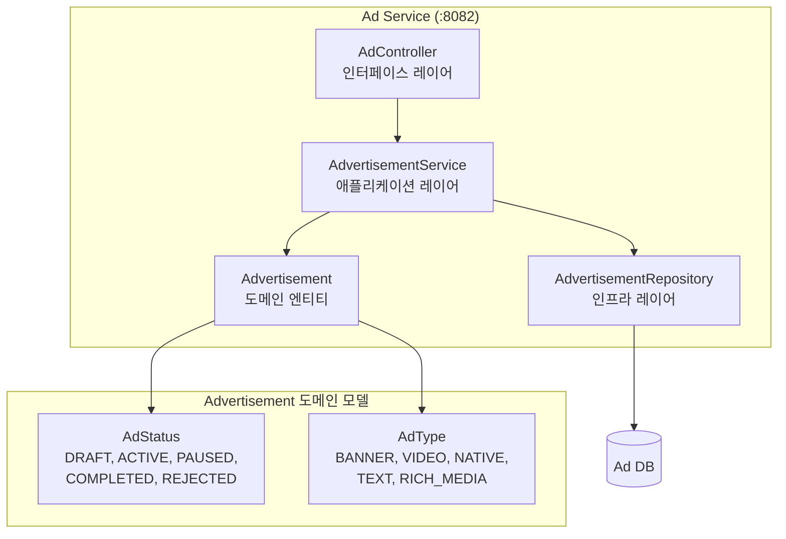
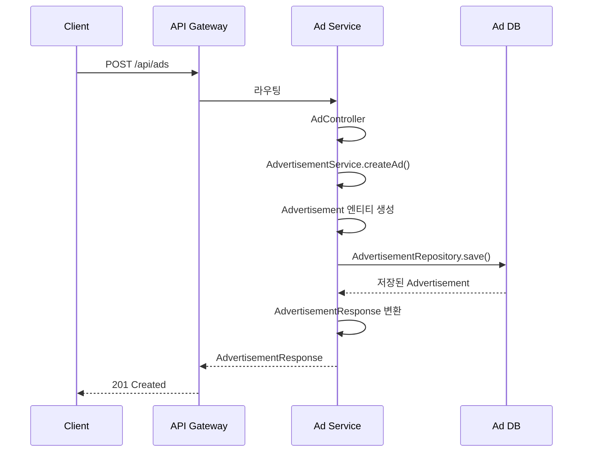

# Ad Service 구조

```mermaid
graph TB
    subgraph "Ad Service (:8082)"
        A_Controller[AdController<br/>인터페이스 레이어]
        A_Service[AdvertisementService<br/>애플리케이션 레이어]
        A_Entity[Advertisement<br/>도메인 엔티티]
        A_Repo[AdvertisementRepository<br/>인프라 레이어]
    end
    
    A_Controller --> A_Service
    A_Service --> A_Entity
    A_Service --> A_Repo
    A_Repo --> AdDB[(Ad DB)]
    
    subgraph "Advertisement 도메인 모델"
        A_Entity --> A_Status[AdStatus<br/>DRAFT, ACTIVE, PAUSED,<br/>COMPLETED, REJECTED]
        A_Entity --> A_Type[AdType<br/>BANNER, VIDEO, NATIVE,<br/>TEXT, RICH_MEDIA]
    end
```

# Ad Service 실행 흐름

```mermaid
sequenceDiagram
    participant Client
    participant Gateway as API Gateway
    participant Ad as Ad Service
    participant DB as Ad DB
    
    Client->>Gateway: POST /api/ads
    Gateway->>Ad: 라우팅
    Ad->>Ad: AdController
    Ad->>Ad: AdvertisementService.createAd()
    Ad->>Ad: Advertisement 엔티티 생성
    Ad->>DB: AdvertisementRepository.save()
    DB-->>Ad: 저장된 Advertisement
    Ad->>Ad: AdvertisementResponse 변환
    Ad-->>Gateway: AdvertisementResponse
    Gateway-->>Client: 201 Created
``` 