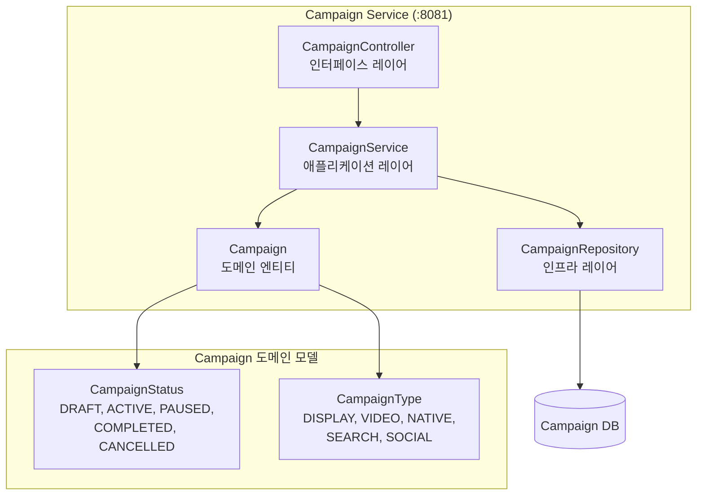
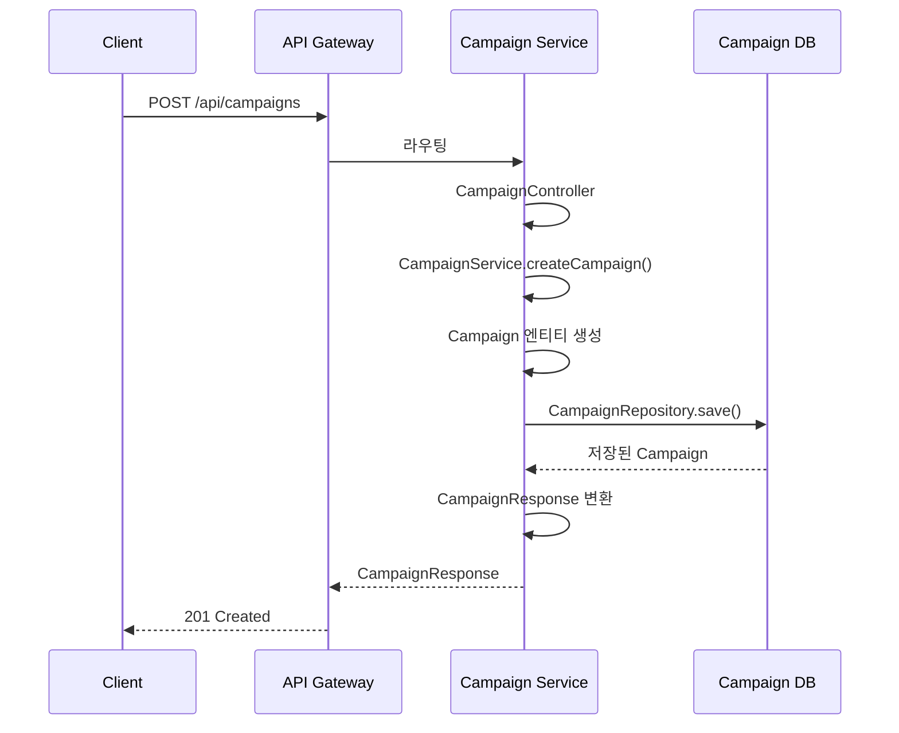

# Campaign Service 구조

```mermaid
graph TB
    subgraph "Campaign Service (:8081)"
        C_Controller[CampaignController<br/>인터페이스 레이어]
        C_Service[CampaignService<br/>애플리케이션 레이어]
        C_Entity[Campaign<br/>도메인 엔티티]
        C_Repo[CampaignRepository<br/>인프라 레이어]
    end
    
    C_Controller --> C_Service
    C_Service --> C_Entity
    C_Service --> C_Repo
    C_Repo --> CampaignDB[(Campaign DB)]
    
    subgraph "Campaign 도메인 모델"
        C_Entity --> C_Status[CampaignStatus<br/>DRAFT, ACTIVE, PAUSED,<br/>COMPLETED, CANCELLED]
        C_Entity --> C_Type[CampaignType<br/>DISPLAY, VIDEO, NATIVE,<br/>SEARCH, SOCIAL]
    end
```

# Campaign Service 실행 흐름

```mermaid
sequenceDiagram
    participant Client
    participant Gateway as API Gateway
    participant Campaign as Campaign Service
    participant DB as Campaign DB
    
    Client->>Gateway: POST /api/campaigns
    Gateway->>Campaign: 라우팅
    Campaign->>Campaign: CampaignController
    Campaign->>Campaign: CampaignService.createCampaign()
    Campaign->>Campaign: Campaign 엔티티 생성
    Campaign->>DB: CampaignRepository.save()
    DB-->>Campaign: 저장된 Campaign
    Campaign->>Campaign: CampaignResponse 변환
    Campaign-->>Gateway: CampaignResponse
    Gateway-->>Client: 201 Created
``` 