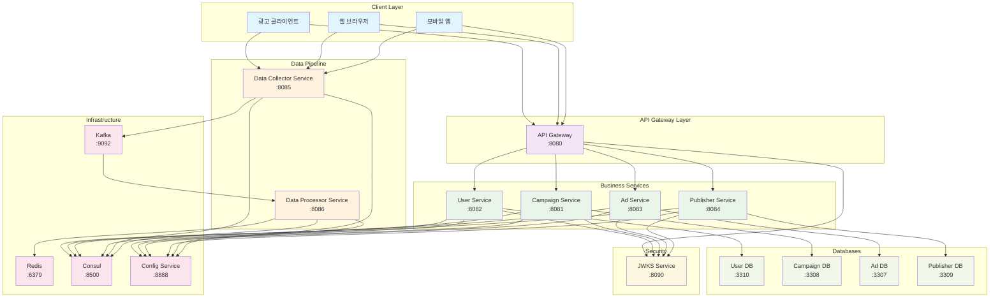
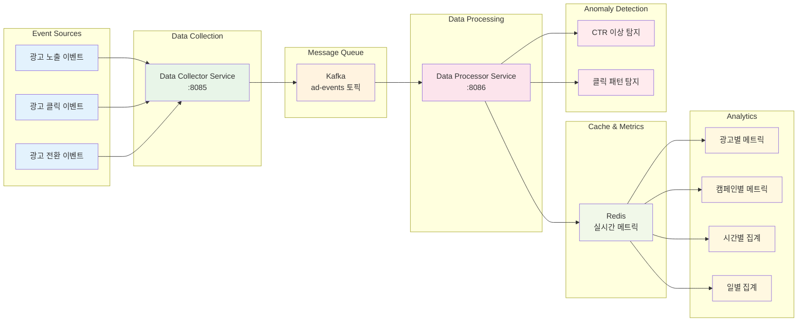
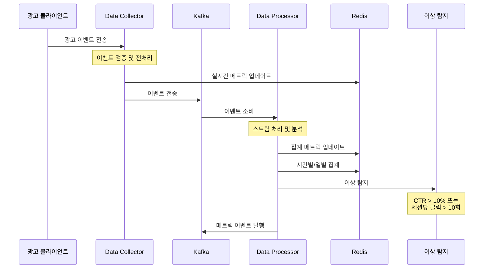
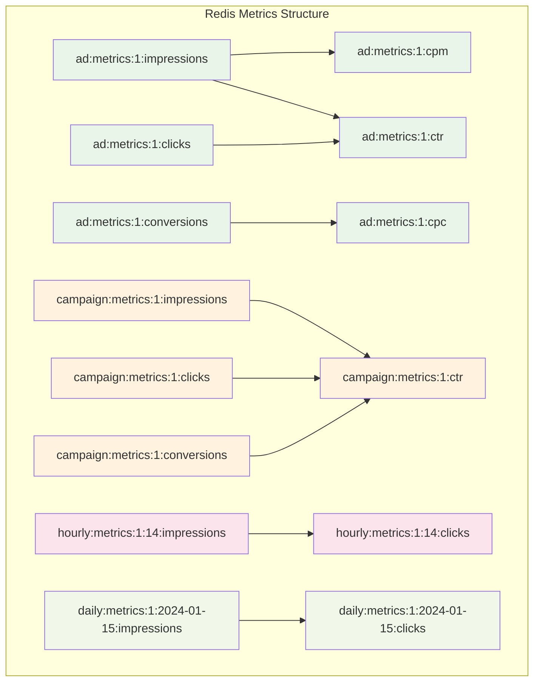

# 광고 데이터 파이프라인 아키텍처

## 전체 시스템 아키텍처

## 데이터 파이프라인 상세 아키텍처

## 데이터 플로우 시퀀스

## Redis 메트릭 구조

## 기술 스택

### 데이터 파이프라인 기술 스택

| 컴포넌트 | 기술 | 역할 |
|---------|------|------|
| **Data Collector** | Spring Boot + Kafka | 이벤트 수집 및 전송 |
| **Data Processor** | Spring Boot + Kafka | 스트림 처리 및 분석 |
| **Message Queue** | Apache Kafka | 이벤트 스트리밍 |
| **Cache** | Redis | 실시간 메트릭 저장 |
| **Service Discovery** | Consul | 서비스 디스커버리 |
| **Configuration** | Spring Cloud Config | 중앙화된 설정 관리 |

### 성능 지표

- **처리량**: 초당 10,000+ 이벤트 처리
- **지연시간**: 평균 50ms 이하
- **가용성**: 99.9% 이상
- **확장성**: 수평 확장 지원

### 모니터링 지표

- **서비스 헬스**: `/actuator/health`
- **메트릭**: Redis 키 기반 실시간 모니터링
- **알림**: 이상 탐지 시 자동 알림
- **로그**: 구조화된 로그 및 추적 