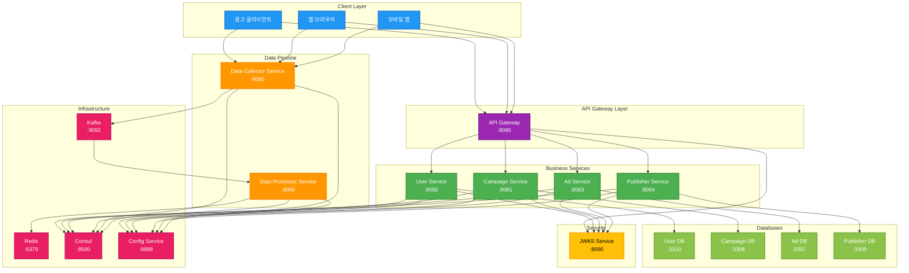
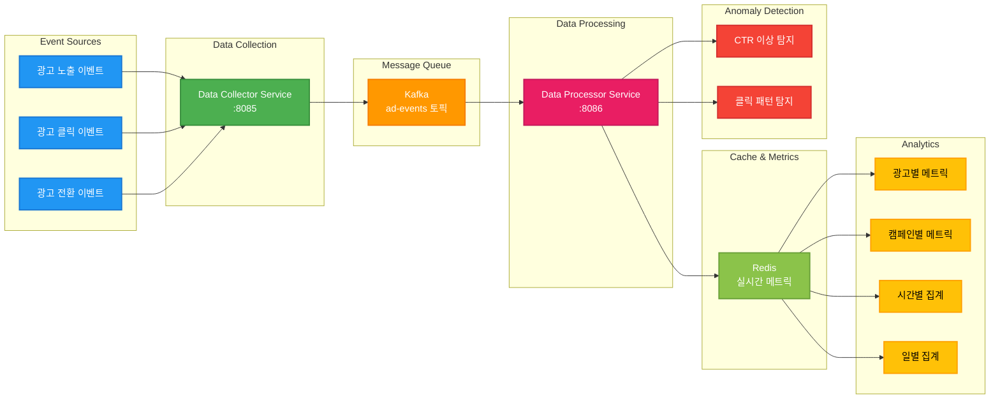
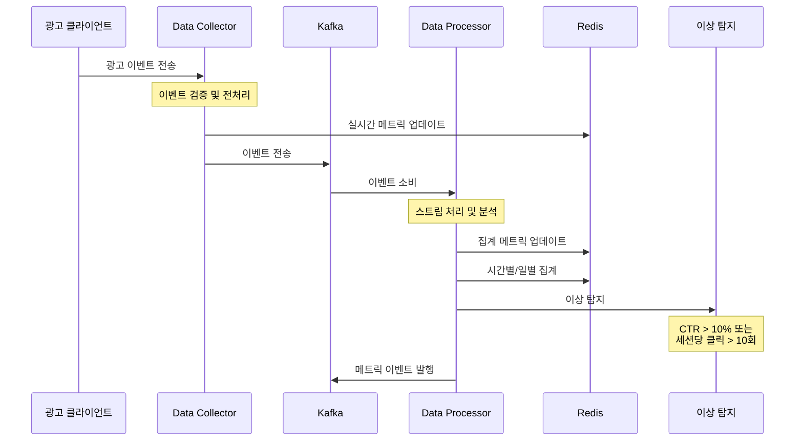
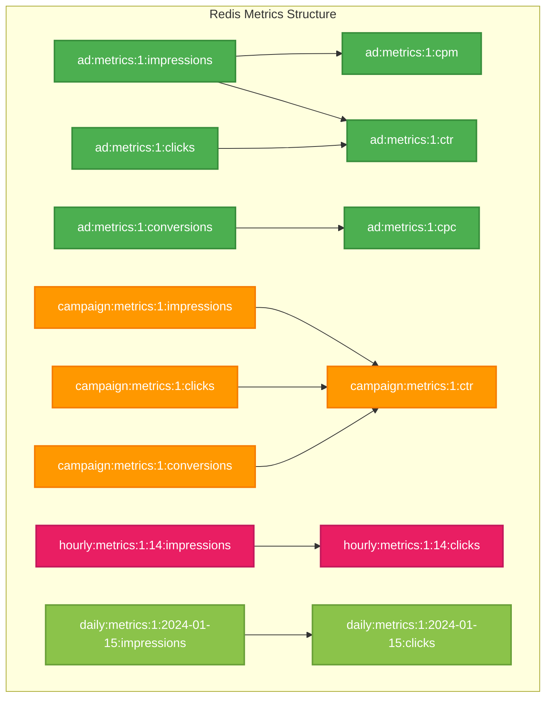

# 광고 데이터 파이프라인 아키텍처

## 전체 시스템 아키텍처

## 데이터 파이프라인 상세 아키텍처

## 데이터 플로우 시퀀스

## Redis 메트릭 구조

## 기술 스택

### 데이터 파이프라인 기술 스택

| 컴포넌트 | 기술 | 역할 |
|---------|------|------|
| **Data Collector** | Spring Boot + Kafka | 이벤트 수집 및 전송 |
| **Data Processor** | Spring Boot + Kafka | 스트림 처리 및 분석 |
| **Message Queue** | Apache Kafka | 이벤트 스트리밍 |
| **Cache** | Redis | 실시간 메트릭 저장 |
| **Service Discovery** | Consul | 서비스 디스커버리 |
| **Configuration** | Spring Cloud Config | 중앙화된 설정 관리 |

