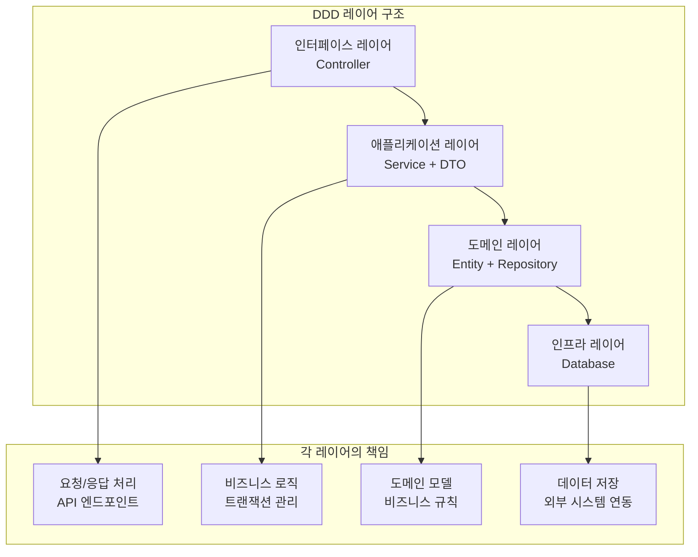

# DDD 아키텍처 패턴

```mermaid
graph TB
    subgraph "DDD 레이어 구조"
        Interface[인터페이스 레이어<br/>Controller]
        Application[애플리케이션 레이어<br/>Service + DTO]
        Domain[도메인 레이어<br/>Entity + Repository]
        Infrastructure[인프라 레이어<br/>Database]
    end
    
    Interface --> Application
    Application --> Domain
    Domain --> Infrastructure
    
    subgraph "각 레이어의 책임"
        Interface --> I_Resp[요청/응답 처리<br/>API 엔드포인트]
        Application --> A_Resp[비즈니스 로직<br/>트랜잭션 관리]
        Domain --> D_Resp[도메인 모델<br/>비즈니스 규칙]
        Infrastructure --> Inf_Resp[데이터 저장<br/>외부 시스템 연동]
    end
``` 