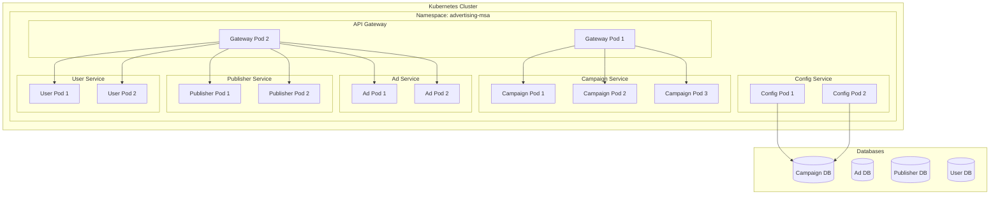

# 서비스 배포 및 스케일링

```mermaid
graph TB
    subgraph "Kubernetes Cluster"
        subgraph "Namespace: advertising-msa"
            subgraph "Config Service"
                Config_Pod1[Config Pod 1]
                Config_Pod2[Config Pod 2]
            end
            
            subgraph "API Gateway"
                Gateway_Pod1[Gateway Pod 1]
                Gateway_Pod2[Gateway Pod 2]
            end
            
            subgraph "Campaign Service"
                Campaign_Pod1[Campaign Pod 1]
                Campaign_Pod2[Campaign Pod 2]
                Campaign_Pod3[Campaign Pod 3]
            end
            
            subgraph "Ad Service"
                Ad_Pod1[Ad Pod 1]
                Ad_Pod2[Ad Pod 2]
            end
            
            subgraph "Publisher Service"
                Publisher_Pod1[Publisher Pod 1]
                Publisher_Pod2[Publisher Pod 2]
            end
            
            subgraph "User Service"
                User_Pod1[User Pod 1]
                User_Pod2[User Pod 2]
            end
        end
    end
    
    subgraph "Databases"
        CampaignDB[(Campaign DB)]
        AdDB[(Ad DB)]
        PublisherDB[(Publisher DB)]
        UserDB[(User DB)]
    end
    
    Config_Pod1 --> CampaignDB
    Config_Pod2 --> CampaignDB
    Gateway_Pod1 --> Campaign_Pod1
    Gateway_Pod1 --> Campaign_Pod2
    Gateway_Pod1 --> Campaign_Pod3
    Gateway_Pod2 --> Ad_Pod1
    Gateway_Pod2 --> Ad_Pod2
    Gateway_Pod2 --> Publisher_Pod1
    Gateway_Pod2 --> Publisher_Pod2
    Gateway_Pod2 --> User_Pod1
    Gateway_Pod2 --> User_Pod2
``` 