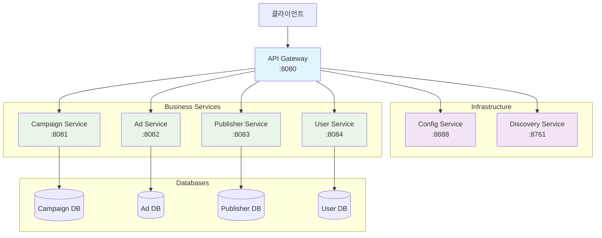

# 전체 MSA 아키텍처 다이어그램

```mermaid
graph TB
    Client[클라이언트] --> Gateway[API Gateway<br/>:8080]
    
    Gateway --> Config[Config Service<br/>:8888]
    Gateway --> Discovery[Discovery Service<br/>:8761]
    
    Gateway --> Campaign[Campaign Service<br/>:8081]
    Gateway --> Ad[Ad Service<br/>:8082]
    Gateway --> Publisher[Publisher Service<br/>:8083]
    Gateway --> User[User Service<br/>:8084]
    
    Campaign --> CampaignDB[(Campaign DB)]
    Ad --> AdDB[(Ad DB)]
    Publisher --> PublisherDB[(Publisher DB)]
    User --> UserDB[(User DB)]
    
    subgraph "Infrastructure"
        Config
        Discovery
    end
    
    subgraph "Business Services"
        Campaign
        Ad
        Publisher
        User
    end
    
    subgraph "Databases"
        CampaignDB
        AdDB
        PublisherDB
        UserDB
    end
    
    style Gateway fill:#e1f5fe
    style Config fill:#f3e5f5
    style Discovery fill:#f3e5f5
    style Campaign fill:#e8f5e8
    style Ad fill:#e8f5e8
    style Publisher fill:#e8f5e8
    style User fill:#e8f5e8
``` 