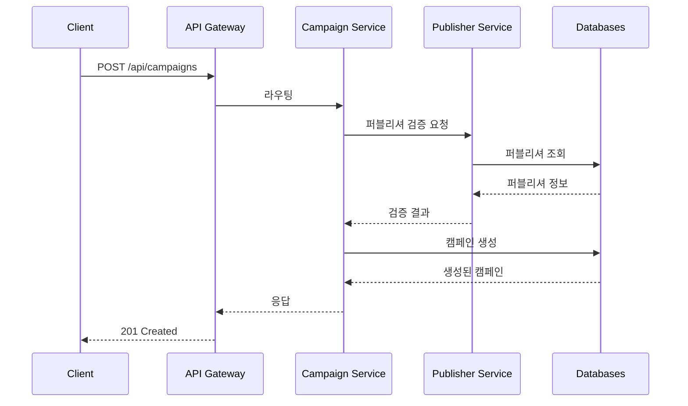
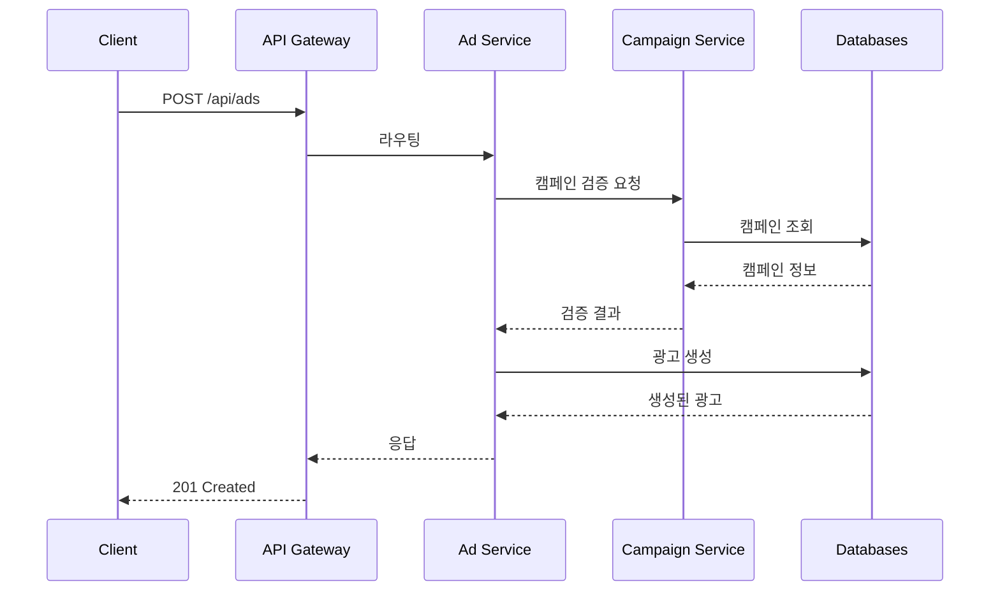

# 서비스 간 통신 흐름

## 캠페인 생성 시 서비스 간 통신

```mermaid
sequenceDiagram
    participant Client
    participant Gateway as API Gateway
    participant Campaign as Campaign Service
    participant Publisher as Publisher Service
    participant DB as Databases
    
    Client->>Gateway: POST /api/campaigns
    Gateway->>Campaign: 라우팅
    
    Campaign->>Publisher: 퍼블리셔 검증 요청
    Publisher->>DB: 퍼블리셔 조회
    DB-->>Publisher: 퍼블리셔 정보
    Publisher-->>Campaign: 검증 결과
    
    Campaign->>DB: 캠페인 생성
    DB-->>Campaign: 생성된 캠페인
    Campaign-->>Gateway: 응답
    Gateway-->>Client: 201 Created
```

## 광고 생성 시 서비스 간 통신

```mermaid
sequenceDiagram
    participant Client
    participant Gateway as API Gateway
    participant Ad as Ad Service
    participant Campaign as Campaign Service
    participant DB as Databases
    
    Client->>Gateway: POST /api/ads
    Gateway->>Ad: 라우팅
    
    Ad->>Campaign: 캠페인 검증 요청
    Campaign->>DB: 캠페인 조회
    DB-->>Campaign: 캠페인 정보
    Campaign-->>Ad: 검증 결과
    
    Ad->>DB: 광고 생성
    DB-->>Ad: 생성된 광고
    Ad-->>Gateway: 응답
    Gateway-->>Client: 201 Created
``` 